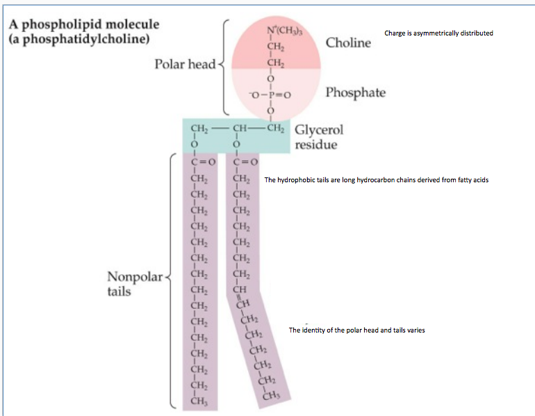
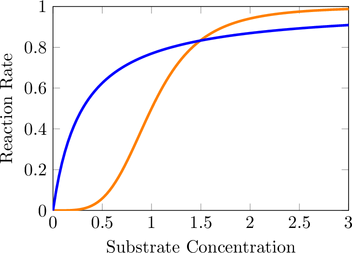

# Diffusion
+ Objectives for the day
    + Cell membranes & epithelia are barriers to diffusion
    + understand the physical perimeters that influence simple diffusion
    + understand the differences between the diffusion of charged and uncharged
      solutes
+ Typical cell
    + more [Na+]out than [Na+]in
    + more [Cl-]out than [Cl-]in
    + less [K+]out than [K+]in
+ Why don't the cells move toward equilibrium?
    + cells must be selectively permeable
    + The membrane controls the movement of substances in and out of the cell
    + The basic function of the cell membrane is to isolate/ protect the cell
      from its surrounding environment
+ How can we derive this outcome?
   + Let us break the membrane down to its molecular components.

## Composition of the cell membrane
+ Membrane composed of a bilayer of phospholipids
+ Proteins and carbohydrates are embedded in the bilayer

### Phospholipid
+ A lipid with an attache phosphate group
+ phospholipids are amphipathic
    + consist of a polar and nonpolar region
        + the charged polar head is hydrophilic
            + therefore gather on hte outside of the water
        + the nonpolar tails are hydrophobic
            + therefore aggregate in the center
                + This is a consequence of the phospholipid tails stopping the
                  water from forming hydrogen bonds
                + The tails are more stable when they are not near the water
    + the two regions are joined by a glycerol molecule




+ The phospholipids in the bilayer is fluid
+ phospholipids slip and slide past each other rapidly
+ about 10^7 times per second they swap places
+ about once a month phospholipids flip to the other side of the membrane
+ Membrane saturation / water fluidity
    + double bonds = less saturation
        + leads to a more fluid membrane
        + more like an oil
    + single bonds = more saturation
        + leads to a less fluid membrane
        + more like butter
+ Membrane fluidity is dependent on temperature
    + as an adaptive solution animals that live in colder environments have a
      higher amount of unsaturated pphospholipids
+ phospholipids in the bilayer are fluid
    + gaps open and close
    + serve as a route for free diffusion
+ water molecules therefore get a way to go through the membrane
+ small and weakly polarized molecules can pass through the membrane
+ what is the maximum size for diffusion?
    + Glucose is roughly the size but cannot really pass through
+ Simple diffusion of non-charged molecules
+ substances diffuse down their concentration gradient
    + does not require energy
+ closed systems move toward equilibrium or the state of the minimum capacity to
  do work
+ please note cells and organisms are open systems
    + this means that mass can be added or removed from it

### Fick's Diffusion Equation
+ Complex variant

```
J = D((C1 - C2) / X)
where
J:= the amount of substance that flows (per unit area per unit time)
D:= the diffusion coefficient
C1 - C2:= the difference in concentration between the solute at two locations
X:= distance separationg regions of high and low concentration
D:= empirically determined for each solute pair
```

+ Simpler variant: for cell membranes

```
J = P (C1 - C2)
where
P:= permeability: the membrane permeability constant for a substance, and the properties of
that substance
```

+ For certain compounds
    + Albumin - too big
    + estrogen - a steroid and therefore fatty so it passes right through the
      cell membrane
    + water can pass through but not very effectively
    + H+ is very small and can therefore pass through easily

+ all molecules are moving randomly and the net movement of the particles is in
  a single direction
+ net diffusion is determined by concentration

### Diffusion of charged solutes across membranes
+ Lipid bilayer is a barrier to the diffusion of charged molecules
charged molecules are lipophobic
    + the charge acts to significantly lower the permeability of the solute
+ within a short distance of the membrane the charged molecules accumulate
    + They can obstruct the flow of molecules
+ ions can diffuse through special channels
+ in some cases the flow of ions through these channels is *gated*
    + this means that the channel can be turned on and off
+ Diffusion of ions and other charged molecules across the membrane is
  influenced by:
    + the chemical / concentration gradient
    + electrical gradient
+ end result is that the electrical and chemical gradient are inverted
+ electrical gradient is independent of the solute identity

### Facilitated diffusion
+ transport / carrier proteins speed the passive movement of molecules across
  the plasma membrane
    1. Occurs in the direction of the electrochemical equilibrium
    2. Transport is faster than in the absence of the transporter
    3. requires that the solute bind reversibly
    4. does not require energy

### Active transport
+ 3 major parts
    1. performed by several integral membrane proteins
    2. moves substances against the electrochemical gradient
    3. requires energy usually in the form of ATP
+ classic example is is the sodium potassium pump
    + uses energy to maintain the electrochemical gradient for the Na+ and K+
      typically observed within cells
    + exchanges 3Na+ for 2K+
    + how does it work?
        + ions move across the membrane when the enzyme undergoes a conformational
          change
        + energy for the conformational change is provided by the hydrolyation
          of ATP
        + the ATP allows for the movement accross the concentration gradient

### Secondary Active Transport
+ A form of active transport
+ ATP is used indirectly to move against the concentration gradient
+ Example
    + co-transporter binds to glucose and sodium
    + when a sodium potassium pump pumps out Na+ and the glucose is pulled in on
      the outside
    + sodium cannot be brought into the cell unless there is also glucose with
      it
    + Na+ gradient is the battery that powers this transportation

### Osmosis
+ Osmosis is positively correlated with solute concentration (dissolved
  molecules)
+ As the solute concentration changes the rate and the direction of water
  diffusion changes
+ change the solute concentration of the extracellular fluid
    + if in distilled water cell bursts because water enters the cell
    + if in concentrated salt solution cells shrink because water leaves the
      cell to change the concentration gradient
+ Water can move across membranes by dissolving into phospholipid bilayer
+ they also move through aquaporins which are water channels that can increase
  the rate of diffusion by about 10^4

## Metabolism
+ Chemical reactions involve the breaking and formation of bonds
+ The bonds are broken and then reconnected in a different shape (Activation
  energy)
+ This involves a transition that costs energy and then produces energy once one
  gets over the hill
+ catalysts reduce the activation energy
+ enzymes are a protein catalyst

### Reactions
+ reactions can be represented in many ways
+ all enzymes mediate reversible reaction
+ often enzyme mediated reactions require non-protein cofactors or helper
  molecules

### Shapes of reaction curves and enzymes
+ Hyperbolic kinetics
    + one site to interact with substrates
+ Sigmoid kinetics
    + Multiple sites and the interaction between sites affects the rate of the
      reaction

+ The reaction rate increases as substrate concentration increases
    + reaction rate eventually plateaus
    + V\_max maximum reaction velocity and depends on
        + concentration of the enzyme
        + *catalytic effectiveness of enzyme*
        + V = V\_max \*[S]/[S] + K\_m
        + K\_m is the measure of enzyme substrate affinity
            + This leads to different shaped curves
            + lower leads to less curvature because Formation of the enzyme
              substrate complex is rate limiting
    + Isozymes different enzymes that catalyze the same reaction
        + The value of K\_m can change without modifying V\_max

### Regulating enzyme activity
+ reaction rate depends on
    + concentration and identity of the enzyme
+ both the identity and the concentration of enzyme in cell depend on
    + Level of gene expresion
        + transcription translation
    + degradation of the enzyme
    + two general patterns
        + *constitutive* - stays in constant quantitiy
            + rate of synthesis = rate of degradation
        + *inducible* - present at a low level or not at all unless the
          synthesis of the enzyme is induced

### Regulating metabolic pathways
+ Metabolic pathways are series of chemical reaction occurring within a cell
+ rate limiting steps are strategically placed
+ allosteric regulatory molecules bind to an enzyme at a site other than the
  active site
    + the binding of an *activator* stabilizes the active form of the enzyme
    + the binding of an *inhibitor* stabilizes the inactive form of the enzyme
+ Ex:
    + Phosphofructosekinase: key step in glycolytic pathway
        + controlled by many activators and inhibitors
        + energy is needed at this step to reverse this step
        + The most significant rate limiting step in this process
        + it is inefficient to push everything through if there is sufficient
          ATP

#### Covalent Modification
+ Specific Protein Kinases Phosphatases are involved with the phosphorylation of
  proteins
+ The addition or removal of phosphate groups alters the activity of enzymes
+ sometimes the target of a protein kinases is a second protein kinase
    + this leads to the amplification of the original signal
