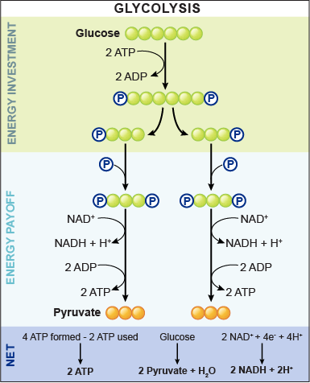

# Metabolism

+ Typical heterotroph
+ Energy starts off as glucose
    + C6H12O6 + 6O2 -> 6CO2 + 6H2O + Energy

## Stages of Cellular Respiration
1. Glycolysis
2. Krebs cycle
    + or fermentation in absence of oxygen
3. Electron Transport
4. Phosphorylation

## Glycolysis
+ Glycolysis costs energy
+ Is allosterically regulated
    + compounds that bind to the active sites of the enzyme that modify the
      amount that it progresses

## Krebs cycle
+ Huge amounts of steps
+ occurs in the matrix of the mitochondria

## Electron transport and oxidative phosphorylation
+ Oxygen is reduced to water as H+ gradient is built up

## other ways of getting energy
+ In absence of oxygen production of lactic acid in cytoplasm
+ Runs gets rid of O2 in order to do more Glycolysis 
+ Needed to regenerate NAD
+ Fermentation produces alcohol from pyruvate

## Ways of making atp
1. Aerobic metabolism using Aerobic metabolism
2. Anaerobic glycolysis some ATP but not very much
3. Using phosphagens - phosphorus containing molecules that apply there
   phosphorus to the thing
4. Myoglobin oxygen storing molecule in striated muscles

