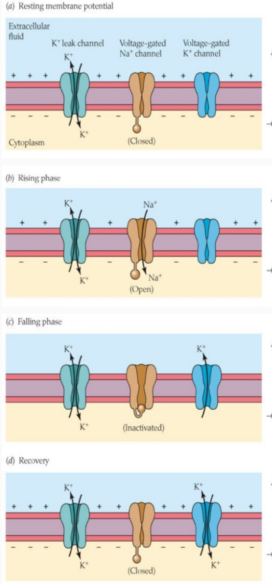

# More stuff about neurons

## Ionic basis of the action potentials
+ Action potentials are effectively all or nothing.
+ They are characterized by
    + Voltage threshold
    + Slope of rising phase
    + Size of overshoot
    + Slope of the falling phase
    + Size of the undershoot
    + cannot trigger an action potential during the undershoot
+ The above characteristics are a consequence of changes in ion permeability

### Goldman Katz Equation -> Understanding ions and shape
+ Three key channels
    1. Leaky K+ channels
    2. Voltage gated Na+ channels
    3. Voltage gated K+ channels

#### At rest
+ Only K+ channels are open
+ This leads to the The E dominating the potential of potassium

#### Rising Phase
+ Na+ channels open
+ E starts to become dominated by Na+. This leads to the increase in the action
  potential

#### Falling phase
+ Na+ channels inactive and voltage gated K+ channels open
    + Open as a consequence of changed concentration of Na+
+ K+ flows back to decrease the concentration
+ This leads to the E returning to the approximately the E of K+

#### Recovery phase
+ Both K+ channels are open so the potential moves lower.
+ The potential is lower because there is an increased amount of flow possible
  between the different potentials.

##### Important: Closed vs Inactive Na+ channels will be on Prelim

### Voltage Clamp Experiments
+ The membrane potential is held at a predetermined value
    1. The amount of current required to hold V_m at a constant value can be
       measured
    2. Hyperpolarizing the membrane only leads to the observation of passive
       transit.
    3. When the membrane is depolarized a bucking current can be measured to
       observe inward and outward ionic currents
+ They performed similar experiments, manipulating Na+ and K+
    + Based on this it was possible to observe that Na+ is responsible for the
      inward current

## Review gating properties of ion channels

### Patch Clamp
+ Used to measure the potential of a single electrode
    + This can be used to show that
        + Inward current flows through Na+ channels
        + Outward current flows through K+ Channels
+ Channels are gated
+ Current flows during a relatively narrow time window
+ The gates are either open or closed but never half closed.

#### Na+ Channels
+ open quickly for a short time
+ depolarization of membrane results in channel opening
+ inactivation is a time dependent process

#### K+ Channels
+ opening lag 
+ are open for a long time or open several times for a shorter while
+ Both opening and closing the channel depends on the membrane potential
+ K+ Channel remains open as long as the membrane is depolarized

## Ion Potential Propagation
+ The action potential moves through the cell
+ But why does it move in a particular direction?
    + Inactive Na+ can't be opened 
    + Closed Na+ channels can be opened
    + Therefore the potential cannot move except in the direction that it didn't
      come from

## What factors influence the conduction velocity of action potentials
+ (For next lecture)?
