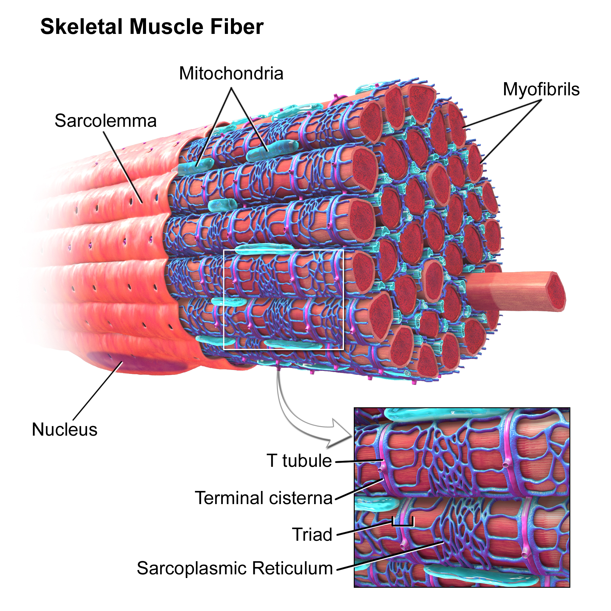

# Physiology of Muscles

## Skeletons
+ There are 3 types of skeletons
    1. Hydrostatic - body cavity is kept under pressure by circular and
       longitudinal muscles
    2. external - exoskeleton - antagonistic muscles span joints and attach to
       stiff cuticle
    3. Internal - Like humans

## Muscle structure
+ Three types
    1. Skeletal / Striated
    2. Cardiac / Heart
    3. Visceral or Smooth

### Striated Muscles
+ Zoom in to striated muscle

+ Organization levels
    + Tissue
    + Cell - Fiber syncytium
    + Myofibril - Many per cell
    + Thick and thin filaments (Myosin and Actin)

## Sliding filament model
+ Myosin and actin ratchet past each other as muscle fibers contract
+ Two regulatory proteins and Ca^2+ control muscle fiber contraction
    + Tropomysin is a helix shaped thing that goes around the actin
        + blocks binding sites for the Myosin
    + Troponin influences the position of the tropomyosin
+ Role of Ca^2+
    + Action potential depolarizes the membrane of the muscle cell
    + Travels down t-tubules
    + Released from the sarcoplasmic membrane is Ca^2+
    + This activates the contraction of muscles
    + Calcium binds with troponin so that the the myosin can bind with the cell
      membrane correctly

## Excitation-contraction coupling
(**************** LOOK AT NOTES ****************)
HUGE LIST OF THINGS

## Development of Force
1. Frequency of action potentials
2. Recruitment of motor units
    + motor unit = motor neuron + all fibers it innervates (supply with nerves)
    + Frequency
        + 10 fibers are effected by a single motor neuron in the eye
        + 1000 in the butt
3. Sarcomere length
    + force depends on sarcomere length
    + in middle of way there is greater force
4. The specific type of muscle
    + Myosin is part of a large molecule
    + Muscles have different isoforms of ATPase
    + after a larger amount of twitches the thing achieves tetanus (i.e. the
      maximum contraction of that muscle)
    + fast muscles 
        + give a strong spike for each twitch - lots of tension for a
          single twitch
        + can have about 3/4 of tetanus from a single impulse
    + slower muscles 
        + only have a weak twitch each time
        + rarely ever fatigue
