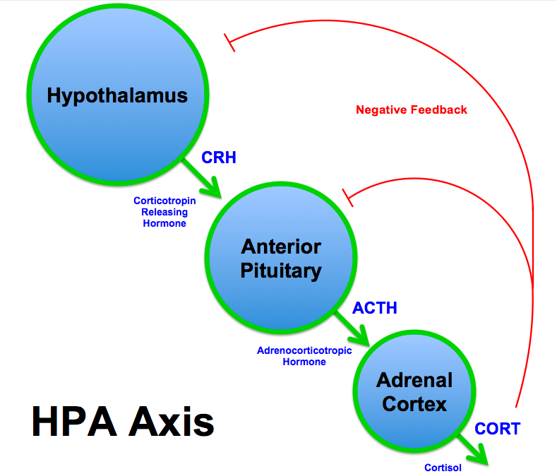

# Stress

## Autonomic nervous system

| Sympathetic (Fight or flight)    | Parasympathetic (Rest and Digest) |
| -------------------------------- | --------------------------------- |
| stimulates epinephrine secretion |                                   |
| constrict blood vesels           | vasodilation                      |
| increase blood pressure          | decrease blood pressure           |
| relax air passages in bronchi    | constrict air passages            |
| accelerate heart rate            | slow heart rate                   |
| dilate pupils                    | constrict pupil                   |
| inhibit salivation               | stimulate salvation               |
| stimulate sweating               | no stimulation of sweat glands    |
| inhibits digestion               | stimulate digestion               |
| stimulates glycogen breakdown    | stimulate glycogen storage        |
| relaxes bladder                  | stimulate bladder contraction     |
| stimulates ejaculation           | stimulate erection                |

## HPA axis

+ Hypothalamus - Pituitary - Adrenal axis
+ adrenal = above the kidney

## Short term physiological response
+ Lots of stuff increases quickly

## Immune response
1. contaminant
2. platelets / blood clotting
3. vasodilation increases (through use of mast cells)
4. pathogens degraded (neutrophils)
5. macrophages + neutrophils phagocytosis
6. macrophages secrete cytokines that attract stuff to the wound
7. Inflammation till everything foreign is gone

+ Sympathetic nervous system stimulates response
    + this takes about 6 minutes

## Long term problems
+ Subordinate members of society have repressed ability to respond to real
  stress
+ epigenetics is a thing

