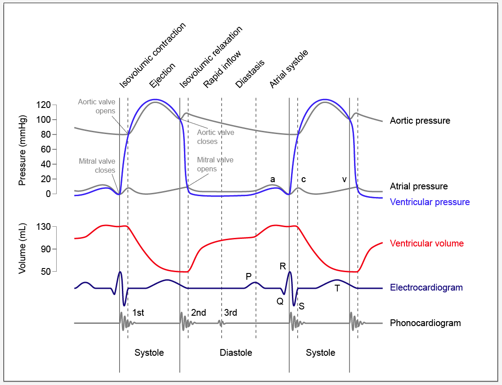

# Circulatory System (More stuffs)

### Cardiac cycle
+ Blood goes in and out of the heart

### Blood flow
+ Total fluid energy = potential energy of pressure + kinetic energy (very small
  and trivial) + potential energy of earths gravity
+ Velocity
    + Velocity = ΔP 0.4 r^4 nl where n = viscosity and l is the length
    + Basic physics essentially
    + Slower through smaller capillaries, etc.
+ dimensions of vasculature change throughout the circuit
+ vessel size affects pressure

+ velocity at a minimum in the capillaries because radius is very tiny
+ increases again near the heart when veins get to be large

#### Valves
+ Veins prevent blood from flowing in the opposite valve
+ this helps maintain flow toward the heart during the diastolic phase
    + the diastolic phase is the phase when stuff happens in reverse order

#### Microcirculatory bed and nervous system control
+ The nervous system can regulate the blood flow
    + vasorestriction - decrease
    + vasodilation - increase

## Weird kinds of hearts
+ Open circulatory systems
    + associated with compensatory adaptations
    + blood flows freely back to the heart from the back of the organism
    + extra hearts are needed
    + very inefficient very low pressure
    + oxygen is not carried in the blood
