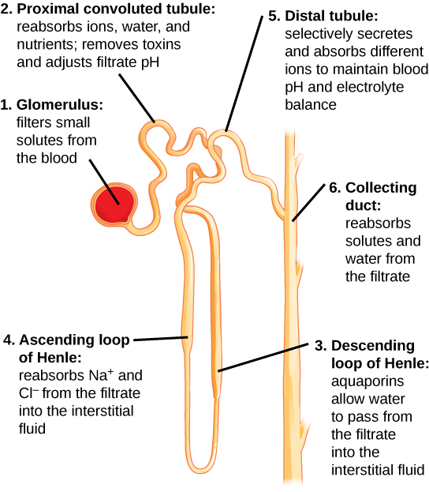

# Kidneys

## Homeostasis
+ The body manages the water that it absorbs
+ Challenge:
    + Osmolarity of the body must be maintained despite:
        + Inconsistent water intake / loss

### U/P Ratio
+ Useful for Kidney function
+ Compares osmolarity of urine and plasma
+ Hypoosmotic :: U/P < 1, urine more dilute than plasma
+ Hyperosmotic :: U/P > 1, urine more concentrated than plasma
+ Isoosmotic :: U/P = 1, urine and plasma equally concentrated

## Ammonia
+ Nitrogenous waste
+ most animals don't tolerate large amounts
+ therefore Must be low concentration
+ Converted to less dangerous compounds:
    + Urea (mostly in mammals)
        + Still bad
    + Uric Acid (birds)
        + Less bad

## Kidneys
1. Many tubular elements (nephrons)
2. Kidneys produce / eliminate solutions from blood (urine)
3. Kidneys regulate the composition and volume of fluids in the body

### Nephrons
+ Tube with blood vessels / capillaries that completely surround them
+ 1 million order of magnitude

### Steps of filtration
1. **Filtration** - pressure filtering of blood
2. **Reabsorption** - reclaim valuable solutes
3. **Secretion** - filter out toxins / solutes
4. **Excretion** - remove the filtrate

#### Filtration
+ Takes place in Bomans capsule
+ Podocytes are a key part of the filter
    + Have pores and allow molecules move through stuff
+ Pressure forces water out of the plasma
    + Coloid pressure goes against flow
    + Capsular hydrostatic pressure goes against flow
+ Macromolecules can't make it through the small gaps
+ All the blood in the body is filtered every 30 minutes
+ Primary filtrate is in extreme excess

#### Reabsorption
+ Water is recovered
+ Small solutes are recovered
+ Convoluted tubules are on hte cell membrane

1. NaK pump move concentration of stuff across the membrane
2. Cotransporters move glucose back accross the membrane
3. Water also is recovered through this process

#### Loop of Henley and the single effect
+ Length differs between different organisms
+ The single effect
    + concentrates the urine
    + Further decreases the amount of water that is lost
+ Counter current increases osmolarity

1. Pumps push water to the next thing
2. Pumping is continuous
3. Pusing in new fluid leads to increasing the concentration continuously

+ A bigger loop leads to a larger concentration
+ On down branch stuff diffuses from the inner thing
+ On the way up push blood to the inner thing

#### Definitive Urine (Salt regulation)
+ We can generate definitive urine by through diuresis
    + In the tube there is low permeability to water. Water is therefore
      retained in the urine.
+ Antidiuresis -
    + Water is retained since water is allowed to freely enter the collecting
      duct
    + Permeability of tube needs to be altered for this to be possible

#### Definitive regulation (Urea)
+ Urea can freely cross all of the tubules
+ Urea is able to move freely across the tubules in kidney
+ It follows the water
+ Vasopressin (Antidiuretic Hormone) regulates the aquaporin quantity in the
  cell membrane
    + Aquaporins are water channels
    + Fast response
+ This increases the water permeability so that diuresis or antidiuresis occurs

#### Detection of Regulation state
+ Current carried by the stretch sensitive cells
+ Flow of ions leads to change in the potential of the cell
+ This will trigger diuresis or antidiuresis based on what is necessary
