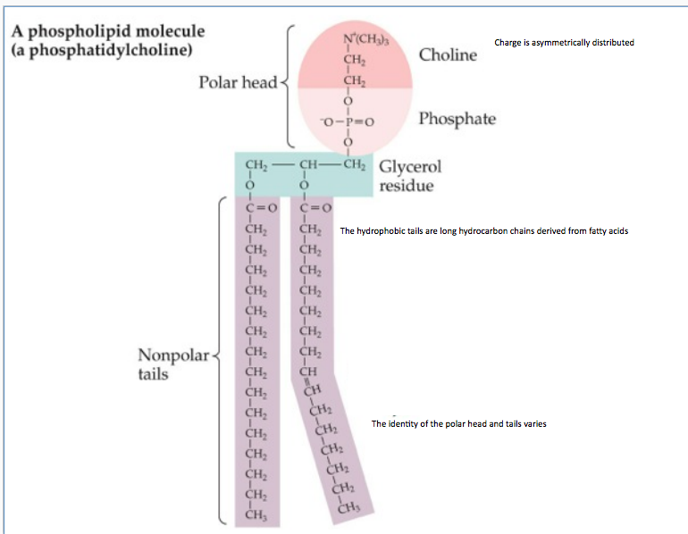
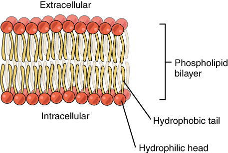

# Diffusion
+ Objectives for the day
    + Cell membranes & epithelia are barriers to diffusion
    + understand the physical perimeters that influence simple diffusion
    + understand the differences between the diffusion of charged and uncharged
      solutes
+ Typical cell
    + more [Na+]out than [Na+]in
    + more [Cl-]out than [Cl-]in
    + less [K+]out than [K+]in
+ Why don't the cells move toward equilibrium?
    + cells must be selectively permeable
    + The membrane controls the movement of substances in and out of the cell
    + The basic function of the cell membrane is to isolate/ protect the cell
      from its surrounding environment
+ How can we derive this outcome?
   + Let us break the membrane down to its molecular components.

## Composition of the cell membrane 
+ Membrane composed of a bilayer of phospholipids
+ Proteins and carbohydrates are embedded in the bilayer

### Phospholipid
+ A lipid with an attache phosphate group
+ phospholipids are amphipathic
    + consist of a polar and nonpolar region
        + the charged polar head is hydrophilic
            + therefore gather on hte outside of the water
        + the nonpolar tails are hydrophobic
            + therefore aggregate in the center
                + This is a consequence of the phospholipid tails stopping the
                  water from forming hydrogen bonds
                + The tails are more stable when they are not near the water
    + the two regions are joined by a glycerol molecule

+ The phospholipids in the bilayer is fluid
+ phospholipids slip and slide past each other rapidly
+ about 10^7 times per second they swap places
+ about once a month phospholipids flip to the other side of the membrane
+ Membrane saturation
    + double bonds = less saturation
        + leads to a more fluid membrane
        + more like an oil
    + single bonds = more saturation
        + leads to a less fluid membrane
        + more like butter

