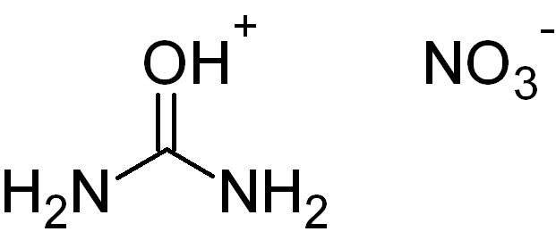

# Introduction / Beginnings

## Things to learn
+ Factual organization and integration
+ Logical analysis
+ Pattern recognition - reasoning by analogy
+ Drawing and visualization skills

## Big themes
+ Structure - 1:1 correspondence with substances
+ Reactivity - chemical change: mechanism

## Stuff

### Uses of urea
+ urea in fertilizer
    + turns back into ammonia through urease
+ in explosives
    + urea + HNO3
    + 
+ in polymers
    + urea + formaldehyde -> H2C=O
    + this is foam insulation
+ in self assembling systems
    + in the right situation hydrogen can hydrogen bond to form an array of
      ureas

## Structure
+ Lewis structures

