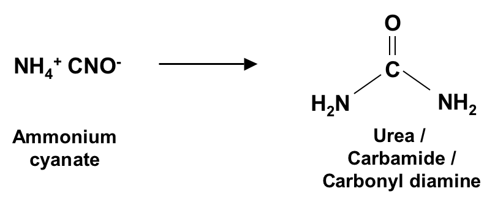

# Introduction / Beginnings

## Things to learn
+ Factual organization and integration
+ Logical analysis
+ Pattern recognition - reasoning by analogy
+ Drawing and visualization skills

## Big themes
+ Structure - 1:1 correspondence with substances
+ Reactivity - chemical change: mechanism

## Stuff

